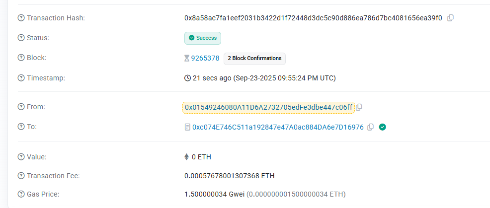

# Private Content Sharing Platform

A secure, decentralized content sharing platform built with Fully Homomorphic Encryption (FHE) technology powered by Zama, enabling users to share confidential content with complete privacy and access control.

## 🔐 Core Concepts

### Fully Homomorphic Encryption (FHE)
This platform leverages Zama's FHE technology to enable computation on encrypted data without ever decrypting it. This revolutionary approach ensures that:

- Content remains encrypted both at rest and during computation
- Smart contracts can process encrypted data without accessing plain text
- Privacy is maintained throughout the entire content lifecycle
- Zero-knowledge proofs validate access rights without revealing content

### Confidential Content Platform
The platform creates a secure marketplace for sensitive information where:

- **Content Creators** can monetize confidential data while maintaining full control
- **Content Consumers** can access encrypted information with guaranteed privacy
- **Smart Contracts** handle access permissions and payments automatically
- **Blockchain** provides immutable audit trails for all transactions

## 🌟 Key Features

### 🔒 **End-to-End Encryption**
All content is encrypted using FHE before being stored on-chain, ensuring complete privacy from creation to consumption.

### 💰 **Monetized Access Control**
Creators can set access prices and control who can view their confidential content through time-limited access tokens.

### ⏰ **Time-Based Access**
Access tokens expire automatically, providing granular control over content availability and reducing unauthorized sharing.

### 🛡️ **Revocable Permissions**
Content creators can instantly revoke access permissions, providing real-time control over sensitive information.

### 📊 **Transparent Analytics**
Blockchain-based tracking of content access patterns while maintaining user privacy through encrypted interactions.

## 🚀 Platform Capabilities

### For Content Creators
- **Secure Upload**: Encrypt and store confidential documents, data, or media
- **Access Management**: Define who can access content and for how long
- **Revenue Generation**: Set pricing for content access and receive payments
- **Real-time Control**: Monitor access patterns and revoke permissions instantly

### For Content Consumers
- **Private Browsing**: Discover content without revealing identity or interests
- **Secure Access**: Purchase time-limited access to encrypted content
- **Verified Authenticity**: Blockchain verification ensures content integrity
- **Privacy Protection**: All interactions remain confidential through FHE

### For Enterprises
- **Compliance Ready**: Built-in privacy controls meet regulatory requirements
- **Scalable Architecture**: Handles enterprise-level content volumes
- **Audit Trails**: Immutable records of all access and modifications
- **Integration APIs**: Easy integration with existing systems

## 🔗 Contract Information

**Smart Contract Address**: `0xc074E746C511a192847e47A0ac884DA6e7D16976`

**Network**: Sepolia Testnet

**Technology Stack**:
- Solidity ^0.8.24
- Zama's FHE Library (@fhevm/solidity)
- Ethereum Virtual Machine
- MetaMask Integration

## 🎥 Demonstration

### Video Demo
Watch the platform in action: [Demo Video](./PrivateContentShare.mp4)

### Transaction Screenshots

The screenshot shows successful on-chain transactions including:
- Content creation with encrypted data
- Access token purchases
- Permission management
- Revenue distribution

## 🏗️ Architecture Overview

### Smart Contract Components

**EncryptedContent Structure**:
- Creator address and metadata
- FHE-encrypted content data
- Encrypted access pricing
- Time-based access controls
- Permission mappings

**AccessToken System**:
- Unique token identifiers
- Expiration timestamps
- Validity flags
- Encrypted access keys

**Event Logging**:
- Content creation events
- Access purchases
- Permission changes
- Revenue tracking

### Security Features

- **Permission Modifiers**: Smart contract-level access control
- **Encryption at Rest**: All sensitive data encrypted on-chain
- **Secure Key Management**: FHE key distribution and validation
- **Audit Trail**: Complete transaction history on blockchain

## 🌐 Live Platform

**Website**: [https://private-content-share.vercel.app/](https://private-content-share.vercel.app/)

**Source Code**: [https://github.com/LavonPrice/PrivateContentShare](https://github.com/LavonPrice/PrivateContentShare)

## 🔧 Usage Instructions

1. **Connect Wallet**: Link your MetaMask wallet to interact with the platform
2. **Create Content**: Upload and encrypt your confidential content with pricing
3. **Browse Marketplace**: Discover available encrypted content from other creators
4. **Purchase Access**: Buy time-limited access tokens for desired content
5. **Manage Permissions**: Monitor and control access to your created content

## 💡 Use Cases

### Business Intelligence
- Share market research and analytics securely
- Distribute confidential business reports
- Provide encrypted competitive analysis

### Healthcare Data
- Share patient records with controlled access
- Distribute research data while maintaining privacy
- Enable secure collaboration between institutions

### Financial Services
- Distribute encrypted trading strategies
- Share compliance reports securely
- Provide confidential market analysis

### Legal Documents
- Share sensitive legal documents
- Distribute encrypted case files
- Enable secure client-attorney communications

## 🔮 Future Roadmap

- **Cross-Chain Compatibility**: Expand to multiple blockchain networks
- **Advanced Encryption**: Implement additional FHE algorithms
- **Mobile Applications**: Native iOS and Android apps
- **Enterprise APIs**: RESTful APIs for business integration
- **Decentralized Storage**: IPFS integration for large file handling
- **Advanced Analytics**: Privacy-preserving usage analytics

---

*Built with cutting-edge Fully Homomorphic Encryption technology to ensure your confidential content remains private, secure, and profitable.*